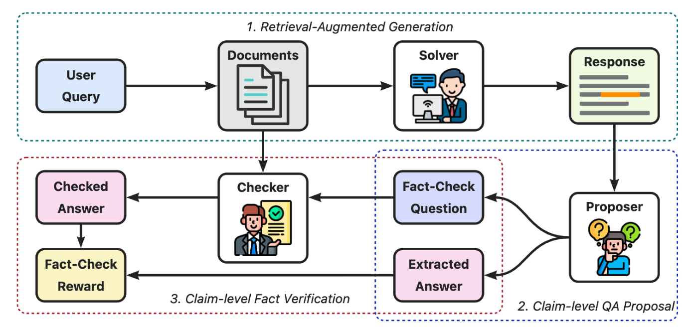

<h1>MARCH: Multi-Agent Reinforced Self-Check for LLM Hallucination</h1>

<!-- Badges -->

  <i><b>  Qwen Large Model Application Team, Alibaba</b></i>

MARCH (Multi-Agent Reinforced Check for Hallucination) is a collaborative framework that enforces factual alignment in RAG systems by leveraging information asymmetry. By decoupling response generation, claim decomposition, and fact verification through specialized agents (Solver, Proposer, Checker), MARCH breaks the cycle of confirmation bias inherent in previous LLM verifiers.

- **Fact-Grounded**: Uses Multi-Agent Reinforcement Learning (MARL) to ensure high-fidelity grounding.
    
- **Blind Verification**: The Checker validates claims in isolation—no access to the Solver's internal logic.
  
- **Agentic Co-evolution**: Agents learn to self-correct through collaborative multi-agent training.

  
   
  <b>Overview:</b> Proposer decomposes Solver‘s response into claim-level verifiable QA pairs. Checker performs blind validation against retrieved documents to recheck factuality.

<h3 align="center">More implementation is coming soon!</h3>